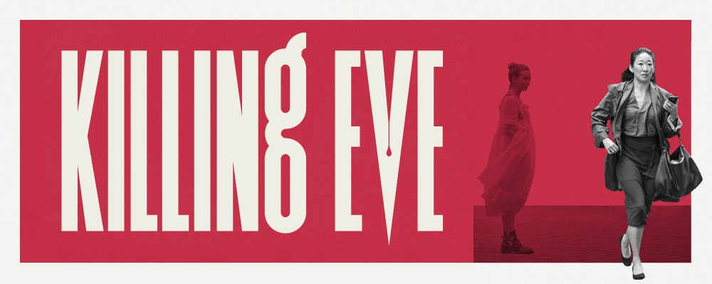

# Sentiment Analysis of Killing Eve TV Series :thumbsup:

Tools: beautifulsoup, selenium, pandas, plotly, nltk, scikit-learn

Performed web scraping to extract reviews of popular tv series to predict their polarity using lexicon-based approaches (TextBlob, VADER) and machine learning classifiers such as Naive Bayes, SVM, and Logistic Regression while dealing with imbalanced data. 

filename | description
------------ | -------------
[WebScrapingIMDBReviews.py](WebScrapingIMDBReviews.py)| Used selenium and beautifulsoup to extract reviews from IMDB website. 
[RottenTomatoesAudienceReviews.py](RottenTomatoesAudienceReviews.py)| Scraped audience reviews from RottenTomatoes website by using selenium and beautifulsoup. 
[RottenTomatoesCriticsReviews.py](RottenTomatoesCriticsReviews.py) | Extracted reviews from critics from RottenTomatoes with use of beautifulsoup and requests library. 

1. Implemented web scraper using BeautifulSoup and selenium to fetch reviews from IMDB and Rotten Tomatoes websites. 
2. Conducted data pre-processing and cleaning by removing stop words, punctuation, numbers and detected language of each review.
3. Visualized data using word clouds and barplots.
4. Calculated sentiment score of each review by comparing it’s tokens with positive and negative lexicon. 
